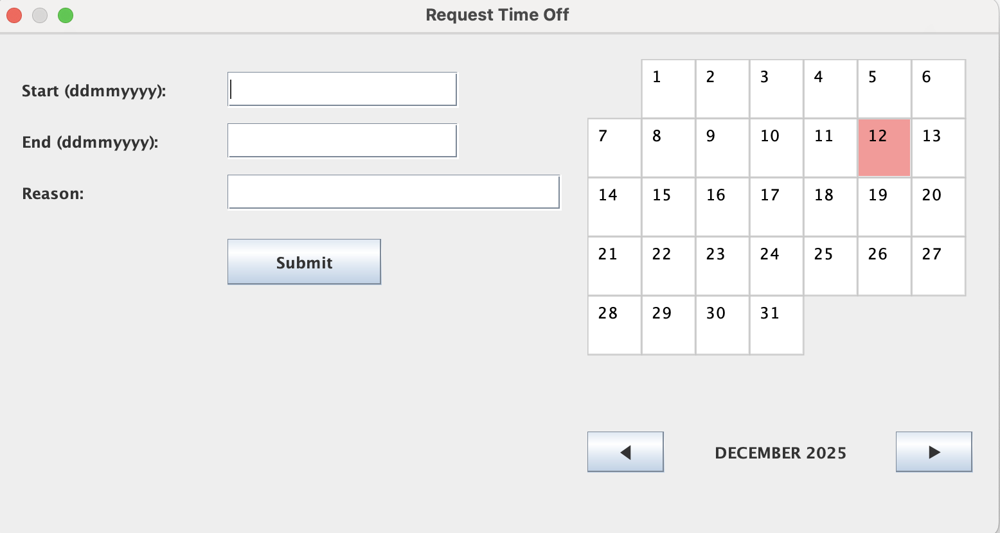
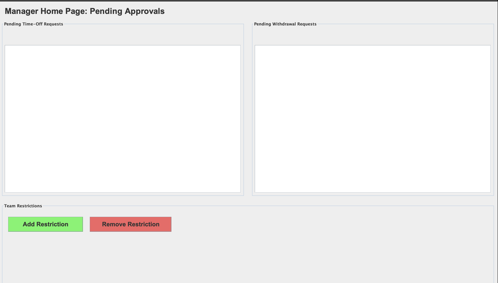
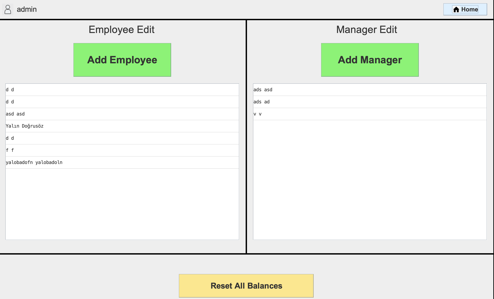

# Timeoff-Management-System
This is a Java application with access levels (Employee, Manager, Administrator) for online timeoff management in businesses.

The UI was built via Java.Swing, and supports all character sets for foreign use. 

## Log-in
The application redirects all users to the log-in page, where username and password is asked for input. 

Since each user has a corresponding access level (Employee, Manager, or Administrator), once they log-in they will be redirected to the corresponding panel where they can use the methods of their role.

After log-in, a user can always click on the Home button at the top right, allowing them to log-out and log back in through a different account.

## Employee

The Employee Panel is shown below. 

The top-right displays the Employee's balance expressed as currentBalance/maxBalance where the number on the right represents the Employee's annual balance, and the left represents their remaining balance for that year.

### Requesting Timeoff
The "Request Timeoff" button pops-up the page shown below, and can be used to request timeoff requests, which are redirected to the Employee's corresponding Manager.

This pop-up form allows the employee to input the starting and ending date of their requested timeoff, and a reason alongside. 

There is a supplementary calendar displayed on the right-hand side showing each month, where the red highlighted days are restricted by the manager. These restrictions may be dates blocked by the manager (for example, an important event) or they may be dates where a number of employees from that manager's team has already taken timeoff, and the system blocks too many employees from asking timeoff at the same dates.

Requests including any restricted dates (which are already displayed) and exceeding the Employee's current balance will be met with an error message preventing them to do so.

### Withdrawal Requests

Employees can choose to withdraw their timeoff requests if they wish to do so. If they have an approved timeoff for a future date, and they change their mind about it, they can submit a withdrawal request through the "Request Withdrawal" button which will, if accepted, cancel their timeoff request and refund their balance.

### Displays

Both a list of previous and future timeoff and withdrawal requests are displayed on the Employee Panel, allowing them to keep track of their submitted requests and view its status.

## Manager

The Manager Panel is shown below.

The two panels for pending timeoff and withdrawal requests are where employee requests are redirected for the manager to process (accept or deny) the requests.

Below, the "Add Restriction" and "Remove Restriction" buttons allow the manager to edit the restrictions on the requests coming from their team by blocking certain dates and/or setting a limit to the maximum people from their team to take timeoff on a given day.

The current version of the application only includes the two mentioned types of restriction, however the Restriction super-class is built extensibly, meaning that it can be adapted to extend and support other types of restrictions easily.

## Administrator

The Administrator Panel is shown below.

The admin can add Employees and Managers through the following buttons which pop-up a form to input corresponding data. 

Furthermore, the lists under the "Add Employee" and "Add Manager" buttons are a list of currently-existing Employee and Manager objects respectively, and double clicking on an object pops-up the same form used to add objects, where the administrator can edit the information of users. 

Managers should be created first, as creating Employees asks for the Employee's corresponding manager through a dropdown option.

The "Reset All Balances" button verifies the administrators' choice through a pop-up, and if clicked and verifies, resets all of the Employees' balances to their annual limit. This button is intended for use at the end of each year, when balances reset.
